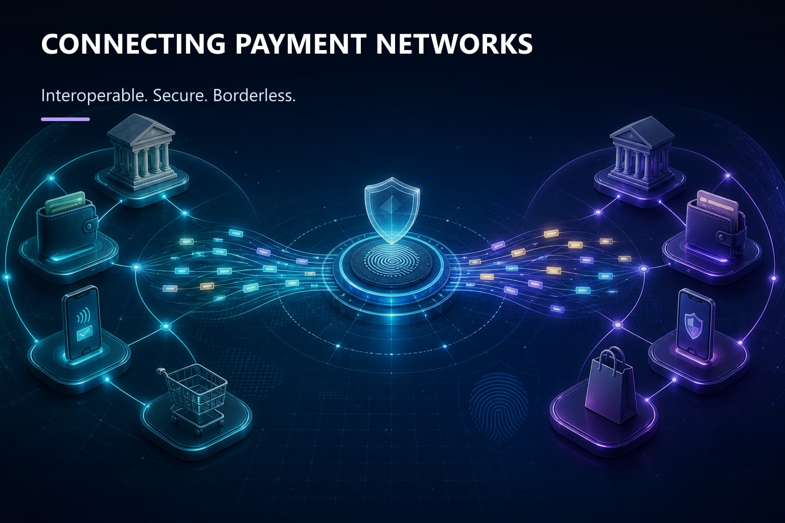

# Interledger Technology: Rethinking the Future of Global Payments

What if money could move across borders as easily as information moves across the internet?

Today, global payments still depend on fragmented banks, currencies, and payment networks. This often makes cross-border transactions slower, more expensive, and harder to manage.

## A connected approach to global payments

Interledger Technology offers a promising way forward. Instead of replacing existing payment systems, Interledger connects them, allowing value to move across different networks through an interoperable framework.

Combined with Open Payments, it can enable new possibilities for digital wallets, international transfers, online businesses, and micropayments.

## Why security and digital forensics matter

Connected payments also demand stronger security. Digital forensics can play an important role in investigating fraud by examining transaction records, timestamps, authentication logs, and other digital evidence.

## A builder perspective from HackUnion

For researchers and builders, Interledger is more than a payment technology. It represents a step toward a financial ecosystem that is interoperable, secure, transparent, and borderless.

At HackUnion, we believe technologies like Interledger are worth exploring, not just to understand how they work, but to imagine what builders can create with them.

Different networks. Different borders. One connected future.
